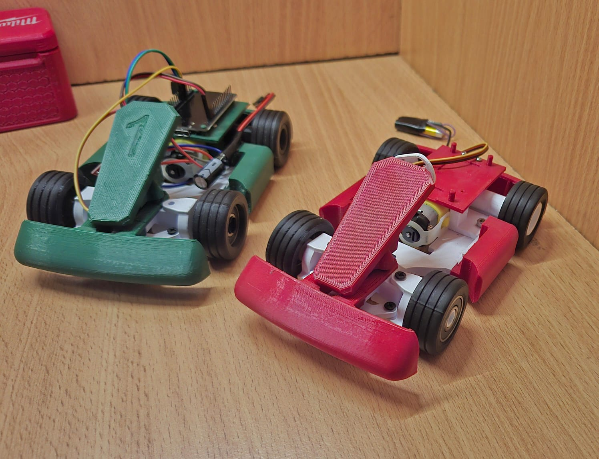
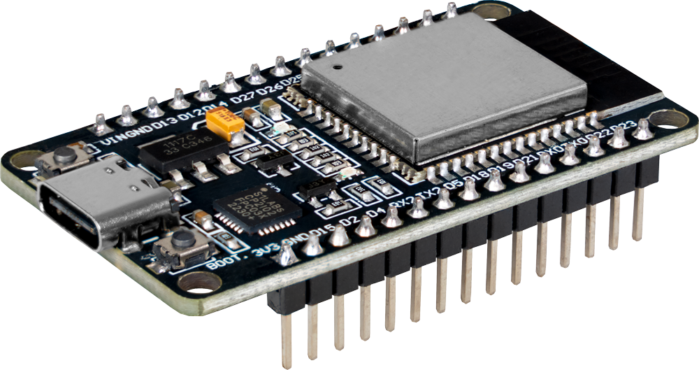
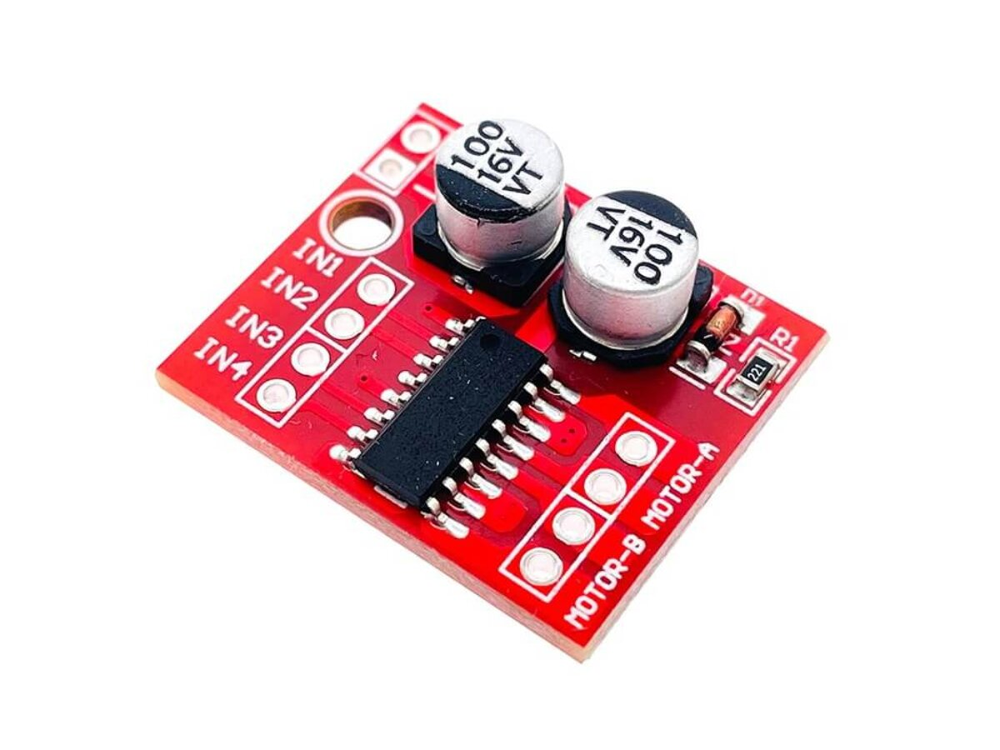
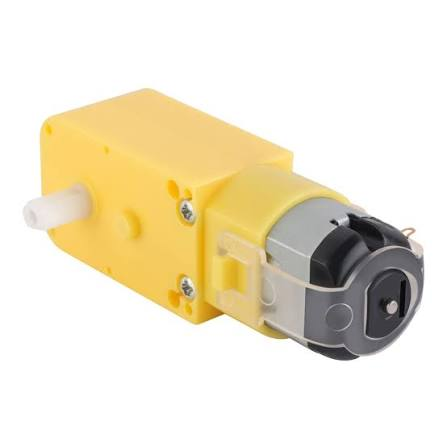
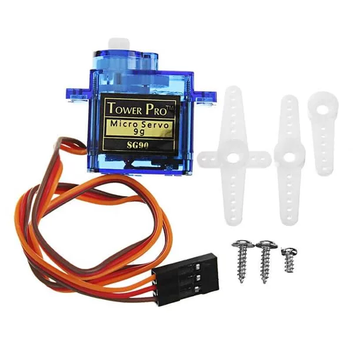
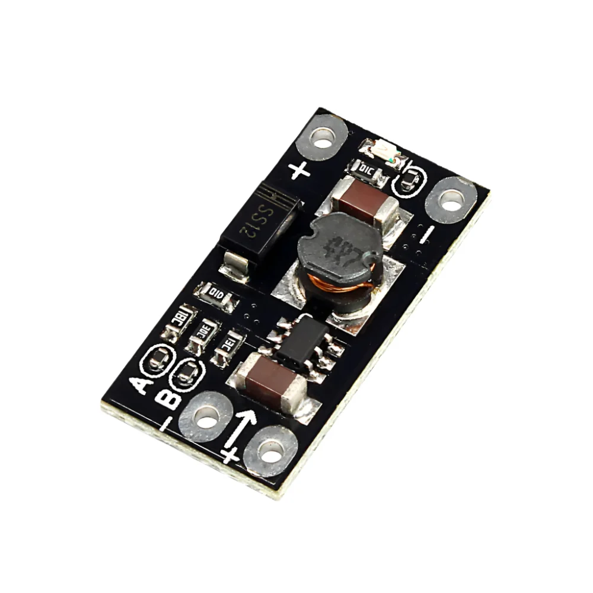
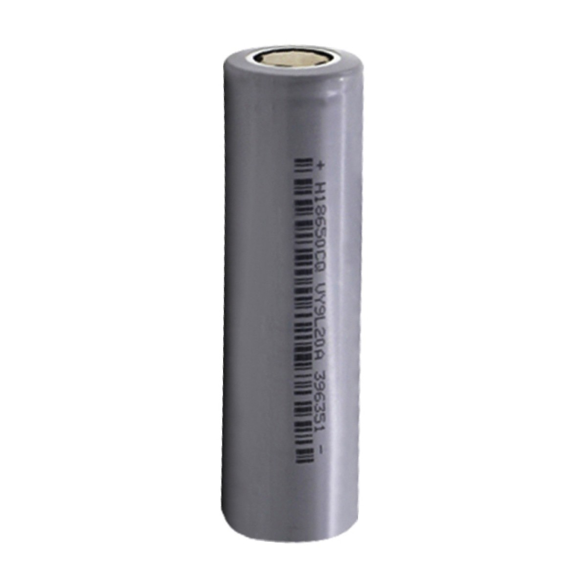

<div align="center">

# 🏎️ Go-Kart RC — Impresión 3D + ESP32

### Un vehículo RC modular, educativo y hecho para experimentar


</div>

---

## 🧩 Descripción del modelo 3D

Este proyecto consiste en un **carrito tipo Go-Kart RC** diseñado para ser impreso en 3D, enfocado en el **aprendizaje, la experimentación y el desarrollo de proyectos de robótica y electrónica**.

El vehículo utiliza un **motorreductor DC** para la tracción trasera y un **servomotor SG90** para el sistema de dirección, logrando un control sencillo pero preciso. Todo el sistema es controlado mediante una **ESP32**, lo que permite una gran flexibilidad para implementar control por **Bluetooth, WiFi, aplicaciones móviles o incluso control autónomo**.

El diseño busca un equilibrio entre **simplicidad, funcionalidad y realismo**, evitando piezas innecesarias y facilitando el ensamblaje, mantenimiento y futuras modificaciones.

<div align="center">


*Los dos prototipos terminados — chasis verde #1 y chasis rojo — corriendo el mismo firmware.*

</div>

---

## ⚙️ Componentes principales

A continuación, cada pieza clave del proyecto y para qué se usó:

<table>
<tr>
<td width="220"></td>
<td>

### 🧠 ESP32 DevKit
El **cerebro del carrito**. Se encarga de crear la red WiFi propia (modo Access Point), servir la página web con el joystick táctil y generar las señales PWM que mueven el motor y el servo. Se eligió por su bajo costo, su WiFi integrado y la cantidad de pines PWM disponibles.

</td>
</tr>
<tr>
<td width="220"></td>
<td>

### 🔀 Módulo driver de motores (doble puente H)
Permite controlar el **sentido de giro y la velocidad** del motorreductor DC a partir de las señales de baja corriente que entrega la ESP32. La ESP32 no puede mover un motor directamente, así que este módulo actúa como intermediario de potencia entre el microcontrolador y el motor.

</td>
</tr>
<tr>
<td width="220"></td>
<td>

### 🔧 Motorreductor DC (TT)
Es el encargado de la **tracción trasera** del Go-Kart. Su caja reductora entrega el torque necesario para mover el chasis impreso en 3D a una velocidad controlable, en lugar de la velocidad demasiado alta de un motor DC sin reducción.

</td>
</tr>
<tr>
<td width="220"></td>
<td>

### 🕹️ Servomotor SG90
Controla la **dirección delantera** del carrito, tipo automóvil (no diferencial). Recibe una señal PWM directamente de la ESP32 y mueve el eje de dirección dentro de un rango limitado (60°–120°) para evitar forzar las piezas impresas.

</td>
</tr>
<tr>
<td width="220"></td>
<td>

### ⚡ Módulo elevador/regulador de voltaje
Adapta el voltaje de la batería a los niveles que necesitan de forma estable la ESP32 y el resto de la electrónica, evitando caídas de tensión cuando el motor exige más corriente (por ejemplo, al arrancar o subir una rampa).

</td>
</tr>
<tr>
<td width="220"></td>
<td>

### 🔋 Batería 18650 (Li-ion)
Es la **fuente de energía** de todo el sistema. Se eligió por su buena relación peso/capacidad, ideal para mantener el chasis liviano sin sacrificar autonomía de manejo.

</td>
</tr>
</table>

---

## 🛠️ Características del diseño

- 📦 Diseño **modular y compacto**
- 🖨️ Fácil de imprimir — **sin geometrías complejas**
- 🧵 Ideal para **PLA o PETG**
- 🚗 Dirección **tipo automóvil** (no diferencial)
- 🎓 Enfoque **educativo y DIY**
- 🔧 Compatible con futuras mejoras: **sensores, cámara, encoders**, etc.

---

## 🎯 Objetivo del proyecto

Este modelo está pensado como:

- 📘 Proyecto educativo para aprender robótica y control
- 🧪 Plataforma base para experimentos con ESP32
- 🧑‍🏫 Kit didáctico para estudiantes o makers
- 🏗️ Base para personalización y mejoras mecánicas o electrónicas

---

## 🖨️ Parámetros de impresión 3D

| Parámetro | Valor |
|---|---|
| **Material** | PLA |
| **Altura de capa** | 0.2 mm |

### 🔩 Herrajes necesarios

| Cantidad | Pieza |
|---|---|
| — | Cojinetes 608RS |
| 10 | Tornillos M3x10mm |
| 8 | Tornillos M3x6mm |

---

## 📁 Estructura del repositorio

```
gokart-rc/
├── README.md
├── firmware/
│   └── GamePad_Digital_ESP32.ino
├── stl/
├── fusion360/
├── imagenes/
└── docs/
```

---

## 🚀 Próximos pasos

- [ ] Control por Bluetooth / gamepad físico
- [ ] Indicador de batería en la interfaz web
- [ ] Integración de sensores/cámara
- [ ] Modo autónomo

---

<div align="center">

### 🤖 Hecho por makers, para makers

*Si este proyecto te sirvió, considera dejar una ⭐ en el repositorio.*

</div>
